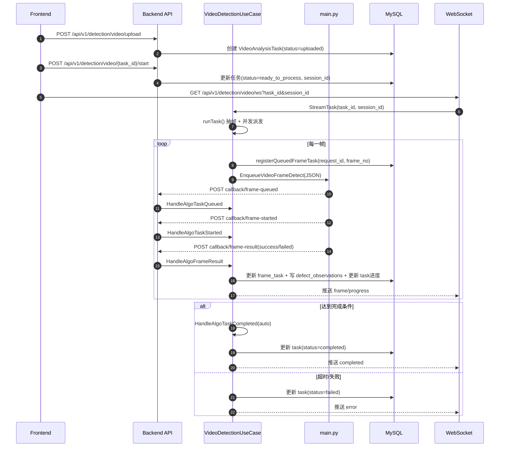

# 视频异步检测链路调用流程分析（后端 + 算法）

本文基于当前仓库代码，解释视频异步检测功能的调用架构与数据流，帮助你快速定位每个阶段的职责与关键函数。

## 1. 架构总览

当前链路是“后端编排 + 算法异步执行 + 回调驱动状态推进”模型：

1. 后端负责：任务创建、抽帧、并发派发、状态聚合、观测落库、WebSocket 推送。
2. 算法负责：单帧请求入队、异步 worker 推理、回调帧状态与结果。
3. 双方契约通过帧级接口对齐：
   - 派发：`POST /algo/video/frames/detect`
   - 回调：`frame-queued` / `frame-started` / `frame-result`（以及任务级 completed/failed）

契约设计文档基线见：

- `doc/设计变更_视频算法异步对接方案.md`
- `doc/算法模块改造说明_视频异步detect.md`

## 2. 端到端时序图（调用流程）

## 3. 数据流图（核心数据对象）

```mermaid
flowchart LR
    A[前端上传视频] --> B[VideoAnalysisTask]
    B --> C[FrameExtractor 抽帧]
    C --> D[request_id/frame_no/timestamp_ms]
    D --> E[dispatchFrameDetect]
    E --> F[算法入队接口 /algo/video/frames/detect]

    F --> G[算法内部队列 task_queue]
    G --> H[algo_worker 推理]
    H --> I[callback frame-result]

    I --> J[VideoFrameTaskRequest 状态更新]
    I --> K[DefectObservation 帧级观测]
    K --> L[缺陷轨迹聚合/确认]
    L --> M[Defect 持久化与证据更新]

    J --> N[VideoAnalysisTask.processed_frames/status]
    M --> N
    N --> O[WebSocket 进度与完成推送]
```

## 4. 关键调用链（按执行顺序）

## 4.1 后端入口层

1. `POST /api/v1/detection/video/{task_id}/start`  
   - 文件：`src/backend/internal/interfaces/http/handler/video_detection_handler.go`
   - 函数：`StartTask`
2. `GET /api/v1/detection/video/ws`  
   - 文件：`src/backend/internal/interfaces/http/handler/video_stream_handler.go`
   - 函数：`Stream`
3. 视频路由注册  
   - 文件：`src/backend/internal/interfaces/http/router/router.go`
   - 组：`/detection/video/...`

## 4.2 编排层（UseCase）

1. 创建会话：`StartTask`  
   - 文件：`src/backend/internal/application/usecase/video_detection_usecase.go`
2. 开始处理：`StreamTask -> runTask`  
   - 文件：同上
3. 并发派发：`dispatchFrameDetect`  
   - 调用 `pythonService.EnqueueVideoFrameDetect(...)`
4. 回调驱动推进：  
   - `HandleAlgoTaskQueued`
   - `HandleAlgoTaskStarted`
   - `HandleAlgoFrameResult`
   - `HandleAlgoTaskCompleted`

## 4.3 算法层（main.py）

1. 帧级入口：`/algo/video/frames/detect`  
   - 入参模型：`VideoFrameDetectRequest`
   - 行为：校验 `frame_ref` -> 入队 -> 回调 `frame-queued` -> 返回 `accepted`
2. worker 消费：`algo_worker`
   - `video_frame_detect` 分支中回调 `frame-started`
   - 推理后回调 `frame-result`

## 4.4 回调接入层（后端）

1. 路由注册：`registerVideoCallbackRoutes`  
   - 新版：`frame-queued` / `frame-started` / `frame-result`
   - 兼容：`task-queued` / `task-started`
2. 处理器：`VideoCallbackHandler`
   - 负责参数绑定与错误映射，再下沉到 UseCase

## 4.5 协议与模型层

1. PythonService 抽象  
   - 文件：`src/backend/internal/domain/service/python_service.go`
   - 新增：`EnqueueVideoFrameDetect`
2. 回调 DTO  
   - 文件：`src/backend/internal/application/dto/video_detection_dto.go`
   - 关键字段：`request_id/task_id/frame_no/timestamp_ms/status/yolo_bboxes`
3. 持久化模型  
   - 文件：`src/backend/internal/domain/model/video_analysis.go`
   - 表对象：
     - `VideoAnalysisTask`（任务级）
     - `VideoFrameTaskRequest`（帧请求级）
     - `DefectObservation`（观测级）

## 5. 一帧数据在系统中的生命周期

以单帧 `request_id=video_task_x_frame_000045` 为例：

1. 后端抽帧后生成 `request_id` 与 `timestamp_ms`。
2. `registerQueuedFrameTask` 先落库一条 `VideoFrameTaskRequest(status=queued)`。
3. `dispatchFrameDetect` 调算法入队接口，携带 `frame_ref` 与 `callback_base_url`。
4. 算法回调 `frame-started` 后，任务变为 processing。
5. 算法回调 `frame-result(success)` 后：
   - `upsertFrameTask` 写帧级耗时与状态
   - `applyFrameResult` 写 `DefectObservation`
   - 轨迹聚合可能触发缺陷确认入库
   - 通过 WS 推送 `frame` + `progress`
6. 达到完成条件后触发 `HandleAlgoTaskCompleted`，任务进入 completed。

## 6. 当前链路中的关键配置项

文件：`src/backend/pkg/config/config.go` 与 `src/backend/config.yaml`

- `video_detection.max_queue_inflight`：后端并发派发上限
- `video_detection.callback_base_url`：算法回调后端基础地址

如果 `callback_base_url` 配置错误，表现通常是：

1. 派发成功但无回调落地
2. 任务最终走超时失败分支

## 7. 建议的排障顺序（实战）

当你怀疑“视频异步链路不通”时，按以下顺序看：

1. 路由是否打到：`router.go` + `video_callback_handler.go`
2. 派发是否成功：`dispatchFrameDetect` 中 `EnqueueVideoFrameDetect` 返回
3. 算法是否真正回调：`main.py` 的 `algo_worker` 回调分支
4. 回调是否写库：`HandleAlgoFrameResult -> upsertFrameTask/applyFrameResult`
5. 任务是否闭环：`HandleAlgoTaskCompleted` / 超时分支

---

如果你希望，我下一步可以继续给你出一版“同文档里的可执行联调 checklist（按命令一步一步）”，让你和算法同学可以直接照着跑。
